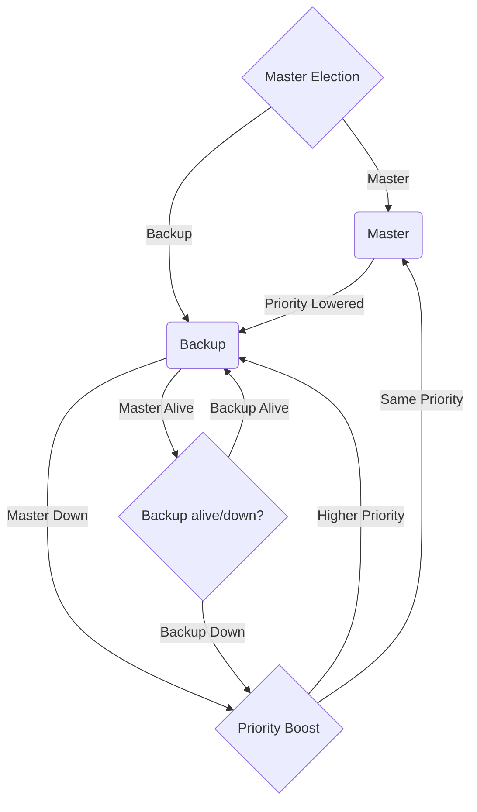

# vrrp-state-machine

This flowchart shows the various states that a Virtual Router Redundancy Protocol (VRRP) can go through during its lifecycle.

- `Master Election`: In this state, the VRRP router starts the process of selecting a master router.

- `Master`: If the VRRP router wins the election, it enters the Master state.

- `Backup`: If the VRRP router does not win the election, it enters the Backup state.

- `Priority Lowered`: If the VRRP router's priority is lowered, it transitions to this state.

- `Down`: If the VRRP router fails, it enters this state.

- `Master Alive`: If the VRRP router in the Master state is still alive, it remains in that state.

- `Master Down`: If the VRRP router in the Master state fails, it transitions to this state.

- `Priority Boost`: If the VRRP router's priority is boosted, it transitions to this state.

- `Higher Priority`: If the VRRP router has a higher priority than the current Master, it transitions back to the Master state.

- `Same Priority`: If the VRRP router has the same priority as the current Master, it remains in the Backup state.

- `Backup Alive`: If the VRRP router in the Backup state is still alive, it remains in that state.

- `Backup Down`: If the VRRP router in the Backup state fails, it transitions to the Master Election state to try to become the new Master.

`vrrp.h` found in this project is copied from the keepalived [project](https://github.com/acassen/keepalived/tree/master) under [GNU General Public License v2.0](). See the file COPYING for copying conditions.
