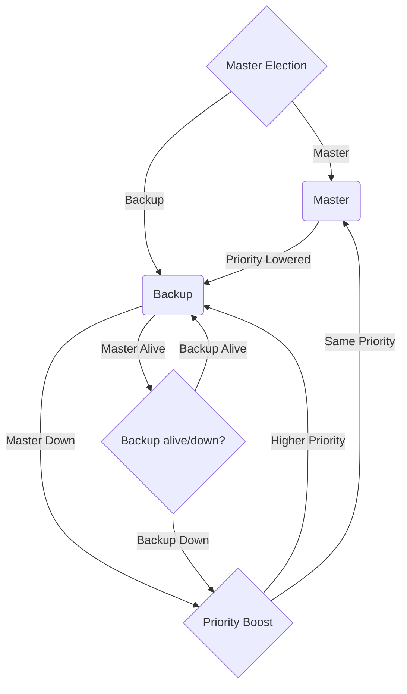

# vrrp-state-machine

This flowchart shows the various states that a Virtual Router Redundancy Protocol (VRRP) can go through during its lifecycle.

- `Master Election`: In this state, the VRRP router starts the process of selecting a master router.

- `Master`: If the VRRP router wins the election, it enters the Master state.

- `Backup`: If the VRRP router does not win the election, it enters the Backup state.

- `Priority Lowered`: If the VRRP router's priority is lowered, it transitions to this state.

- `Down`: If the VRRP router fails, it enters this state.

- `Master Alive`: If the VRRP router in the Master state is still alive, it remains in that state.

- `Master Down`: If the VRRP router in the Master state fails, it transitions to this state.

- `Priority Boost`: If the VRRP router's priority is boosted, it transitions to this state.

- `Higher Priority`: If the VRRP router has a higher priority than the current Master, it transitions back to the Master state.

- `Same Priority`: If the VRRP router has the same priority as the current Master, it remains in the Backup state.

- `Backup Alive`: If the VRRP router in the Backup state is still alive, it remains in that state.

- `Backup Down`: If the VRRP router in the Backup state fails, it transitions to the Master Election state to try to become the new Master.

# What situations can cause a state change or failover?
In the context of the Virtual Router Redundancy Protocol (VRRP), there are several situations that can cause a state change or trigger a failover. Here are some common situations that can lead to VRRP state changes or failovers:

1. **Router Failure:** If the primary router (the one with the highest priority) fails or becomes unreachable, the backup router(s) can detect the failure and transition to the "Master" state, taking over the responsibilities of the virtual router.

2. **Priority Changes:** VRRP routers have a priority value assigned to them. If the priority of the primary router decreases (e.g., due to an administrative action or configuration change), and it falls below the priority of a backup router, the backup router with the higher priority can take over as the master.

3. **Preemption:** VRRP supports preemption, which means that if a failed router recovers and its priority is higher than the current master router, it will take back control as the master. This can cause a state change if preemption is enabled.

4. **Interface State Changes:** If the network interface used by the primary router goes down or becomes unavailable, the backup router may transition to the "Master" state.

5. **VRRP Configuration Changes:** Modifications to the VRRP configuration, such as changing the virtual router ID or IP addresses, can cause a state change or require a manual failover to update the configuration.

6. **Communication Issues:** VRRP routers communicate with each other using multicast or unicast packets. If there are communication issues between the routers, it can lead to state changes or failovers.

7. **Authentication Failures:** VRRP routers often use authentication methods to verify the legitimacy of messages. If authentication fails, it can trigger a state change.

8. **Manual Intervention:** Administrators can manually initiate a failover by modifying the VRRP configuration or restarting VRRP on one of the routers. This is often done for maintenance or testing purposes.

9. **Hardware or Software Failures:** Failures in the hardware or software of a router can lead to unexpected VRRP state changes or failovers.

10. **Load Balancing:** Some configurations may involve load balancing between multiple routers. In such cases, changes in traffic patterns or load may trigger state changes or load-balancing decisions.

It's important to note that VRRP is designed to provide fault tolerance and high availability, so it actively monitors the health of routers and network interfaces to ensure that the most suitable router becomes the master. The specific behavior can vary depending on the implementation and configuration of VRRP in your network.

`vrrp.h` found in this project is copied from the keepalived [project](https://github.com/acassen/keepalived/tree/master) under [GNU General Public License v2.0](). See the file COPYING for copying conditions.
